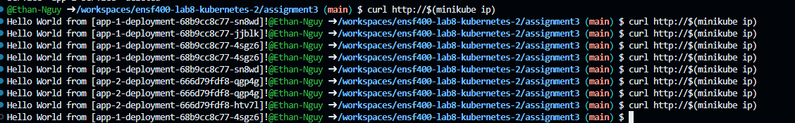

# Instructions

## Command-line Commands

1. Run the following commands to deploy the Nginx service and the app services.

```bash
minikube start
minikube addons enable ingress
kubectl apply -f '*.yaml'
```

2. Run the following to generate the outputs

```bash
curl http://$(minikube ip)
```



3. Cleanup for the pods

```bash
minikube delete
```